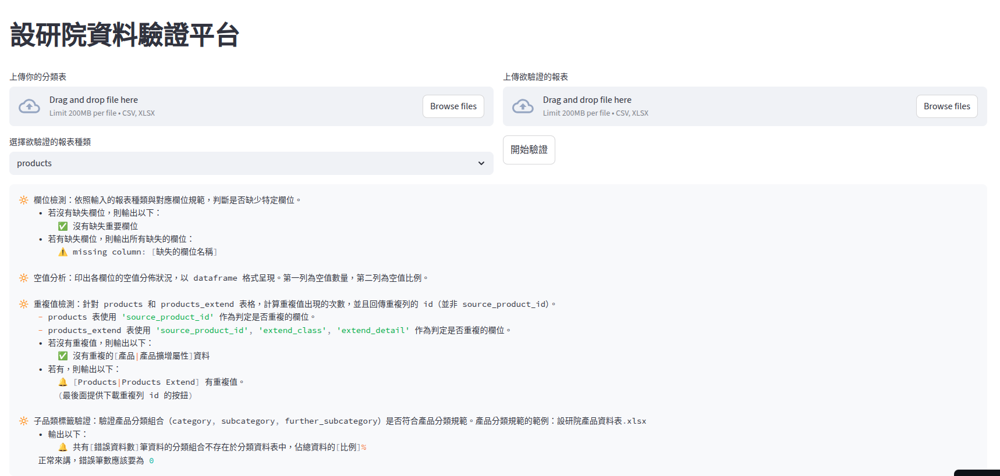

# 設研院資料驗證程式


> 此專案是用來檢驗透過 statistics 專案產出的報表是否符合設研院的規範。

### Web Service (Cloud)
- 點擊以下連結，開啟設研院資料驗證程式平台。

    📍[Streamlit 連結](https://tdridataverifierofficial-m54djo3ziybnddahekbzhm.streamlit.app/)

- 進入之後可以看到以下畫面：
  
    - 點擊左上方資料上傳 widget，上傳標準化過後的產品分類表，以作為判斷各報表中的產品分類是否正確的標準。
    - 點擊右上方資料上傳 widget，上傳欲驗證格式的報表。
    - 選擇對應的報表種類。
        ⚠️ 選擇的報表種類需要與您上傳的報表格式匹配！
    - 點擊「開始驗證」按鈕

### Build Setup (Local)
Edit directly in III DTRI computer, or clone the repo by the following command:
```bash
git clone https://github.com/taaqat/tdri_data_verifier_official.git
```

Install required packages by pip. `Streamlit` is necessary for this project.
```bash
pip install -r requirements.txt
```

Finally, execute the application by the command:
```bash
streamlit run app.py
```


### 資料驗證規則

#### Step 1: 欄位檢測
依照輸入的報表種類與對應欄位規範，判斷是否缺少特定欄位。

#### Step 2: 空值分析
印出各欄位的空值分佈狀況，以 dataframe 格式呈現。第一列為空值數量，第二列為空值比例。

#### Step 3: 重複值檢測
針對 products 和 products_extend 表格，計算重複值出現的次數，並且回傳重複列的 id（並非 source_product_id）。

- **products 表**：使用 `source_product_id` 作為判定是否重複的欄位
- **products_extend 表**：使用 `source_product_id`, `extend_class`, `extend_detail` 作為判定是否重複的欄位

#### Step 4: 擴充屬性檢測
- 針對所選報表的擴充屬性規範，判斷資料中是否缺少特定擴充屬性的統計資料，以 dataframe 呈現
- 分析各個 `extend_class` 下，`extend_subclass` 出現空值的比率
- 若為 products_extend 報表，額外檢查 `extend_unit` 出現空值的比率

#### Step 5: 子品類標籤驗證
驗證產品分類組合（`category`, `subcategory`, `further_subcategory`）是否符合產品分類規範。

> 產品分類規範參考：[設研院產品資料表.xlsx](source/設研院產品分類表.xlsx)

#### Step 6: 名次驗證
列印出名次（品牌名次、因素名次）欄位的值域 (unique value)，並與規範名次進行比對。

#### Step 7: 小數點位數驗證
對有 `extend_stats` 欄位的報表，檢驗以下兩點：

- **ratio**：是否最多至小數三位
- **avg_price**：是否最多至小數兩位


### 執行測試
本專案使用 pytest 進行測試，測試代碼組織如下：
- `tests/unit/`: 單元測試，測試各個功能模組的獨立功能
- `tests/integration/`: 整合測試，測試模組之間的互動
- `tests/functional/`: 功能測試，測試完整的資料驗證流程

執行所有測試：
```bash
python run_tests.py
```

或直接使用 pytest：
```bash
pytest -v
```

執行特定類型的測試：
```bash
pytest tests/unit/ -v  # 只執行單元測試
pytest tests/integration/ -v  # 只執行整合測試
pytest tests/functional/ -v  # 只執行功能測試
```

執行完整測試並輸出到檔案

這個腳本會執行完整測試並將結果保存到時間戳命名的檔案中：

```bash
./venv/bin/python run_complete_test.py
```