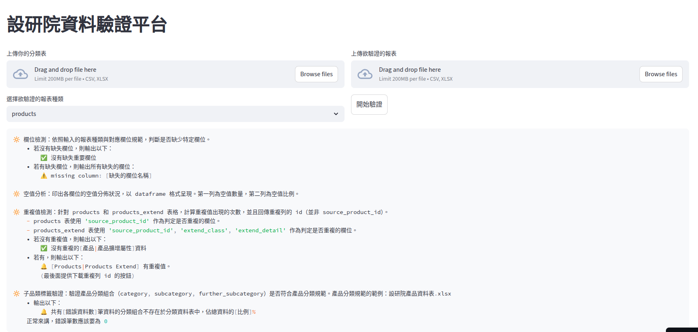

# 設研院資料驗證程式

> 此專案是用來檢驗透過 statistics 專案產出的報表是否符合設研院的規範。

## 📋 目錄
- [線上服務使用說明](#線上服務使用說明)
- [本地端安裝設定](#本地端安裝設定)
- [資料驗證規則](#資料驗證規則)
- [開發者資訊](#開發者資訊)

---

## 線上服務使用說明

### 📝 使用步驟
進入 Streamlit 平台後，請依照以下步驟進行操作：



1. **上傳產品分類表**  
   點擊左上方資料上傳區塊，上傳標準化過後的產品分類表，此表將作為驗證各報表中產品分類的標準依據。

2. **上傳待驗證報表**  
   點擊右上方資料上傳區塊，上傳欲驗證的報表檔案。

3. **選擇報表種類**  
   ⚠️ **重要提醒**：請確保所選擇的報表種類與您上傳的報表格式完全匹配！

4. **開始驗證**  
   點擊「開始驗證」按鈕，系統將自動執行驗證流程並顯示結果。

---

## 本地端安裝設定

若需要在本地環境執行此程式，請依照以下步驟進行安裝：

### ⚙️ 系統需求
- **Python 3.8 或以上版本**（推薦 3.9 - 3.11）
- pip（Python 套件管理工具）

### 📥 下載專案
可直接在設研院電腦上編輯

### 🔧 建立虛擬環境（選用）
建議建立虛擬環境以避免套件版本衝突：
```bash
python -m venv venv
```

### 🔧 啟用虛擬環境
```
source venv/bin/activate  # macOS/Linux 系統
# 或
venv\Scripts\activate  # Windows 系統
```

### 📦 安裝相依套件
安裝所需的 Python 套件（包含 Streamlit）：
```bash
pip install -r requirements.txt
```

### ▶️ 執行應用程式
使用以下指令啟動程式：
```bash
streamlit run app.py
```

---


## 資料驗證規則

本系統提供七個步驟的自動化驗證流程，確保資料品質符合設研院規範：

### 步驟一：欄位檢測
依照輸入的報表種類與對應欄位規範，檢查是否缺少必要欄位。

**檢測項目**：
- 驗證所有必填欄位是否存在
- 檢查欄位名稱是否符合規範

### 步驟二：空值分析
分析各欄位的空值分佈狀況，以表格形式呈現完整的資料完整性報告。

**輸出內容**：
- 第一列：各欄位的空值數量
- 第二列：各欄位的空值比例

### 步驟三：重複值檢測
針對 products 和 products_extend 表格進行重複值檢測，並回傳重複資料列的識別碼。

**檢測規則**：
- **products 表**：以 `source_product_id` 判定是否重複
- **products_extend 表**：以 `source_product_id`、`extend_class`、`extend_detail` 組合判定是否重複

### 步驟四：擴充屬性檢測
檢查報表中的擴充屬性是否完整，並分析各項屬性的資料完整度。

**檢測項目**：
- 驗證是否缺少特定擴充屬性的統計資料
- 分析各個 `extend_class` 下，`extend_subclass` 的空值比率
- 若為 products_extend 報表，額外檢查 `extend_unit` 的空值比率

### 步驟五：子品類標籤驗證
驗證 開發者資訊

<details>
<summary>📊 測試說明（開發人員專用）</summary>

### 執行測試
本專案使用 pytest 進行測試，測試代碼組織如下：
- `tests/unit/`：單元測試，測試各個功能模組的獨立功能
- `tests/integration/`：整合測試，測試模組之間的互動
- `tests/functional/`：功能測試，測試完整的資料驗證流程

**執行所有測試**：
```bash
pytest -v
```

**執行特定類型的測試**：
```bash
pytest tests/unit/ -v          # 只執行單元測試
pytest tests/integration/ -v   # 只執行整合測試
pytest tests/functional/ -v    # 只執行功能測試
```

</details>

---


### 執行測試
本專案使用 pytest 進行測試，測試代碼組織如下：
- `tests/unit/`: 單元測試，測試各個功能模組的獨立功能
- `tests/integration/`: 整合測試，測試模組之間的互動
- `tests/functional/`: 功能測試，測試完整的資料驗證流程

執行所有測試：
```bash
pytest -v
```

執行特定類型的測試：
```bash
pytest tests/unit/ -v  # 只執行單元測試
pytest tests/integration/ -v  # 只執行整合測試
pytest tests/functional/ -v  # 只執行功能測試
```

